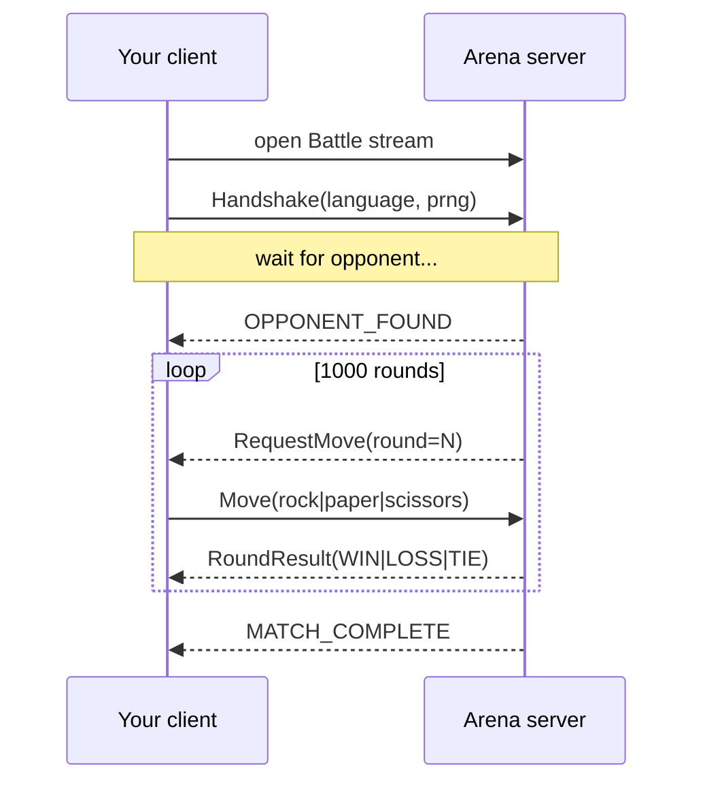
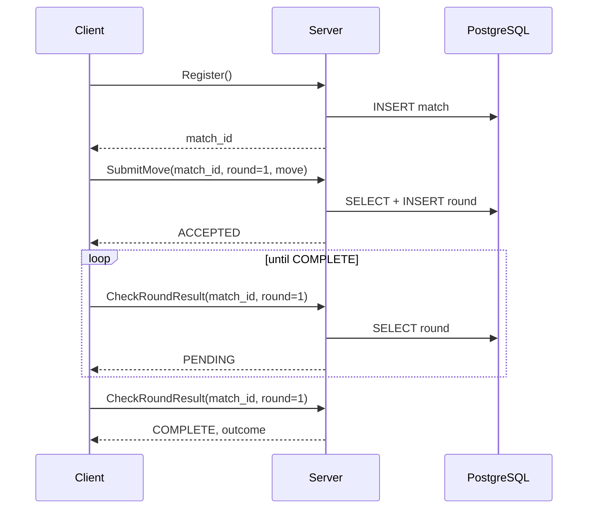

# Lesson 0: Your First gRPC Call

**Goal:** Understand what gRPC is, run the arena, and make your first RPC — without caring which Java framework sits behind it.

---

## What is gRPC?

[gRPC](https://grpc.io/) is a way for programs to call functions on other programs over the network. Instead of designing REST URLs and JSON shapes by hand, you:

1. Write a **`.proto` file** — a language-neutral contract describing services and messages.
2. Run a **code generator** — produces client and server stubs in Java, Go, Python, etc.
3. Implement the server interface and call it from any generated client.

Under the hood, gRPC uses **HTTP/2** (multiplexed connections, binary framing, header compression) and **Protocol Buffers** (compact, typed messages). You get strong typing, generated code, and four RPC shapes out of the box:

| RPC type | Client sends | Server sends | Arena example |
|---|---|---|---|
| **Unary** | 1 message | 1 message | `Register`, `SubmitMove` |
| **Server streaming** | 1 message | stream | — |
| **Client streaming** | stream | 1 message | — |
| **Bidirectional streaming** | stream | stream | `Battle` |

This project uses **unary** (stateless, polling) and **bidirectional streaming** (stateful, push) for the same game so you can *feel* the difference.

---

## The contract lives in `common/`

Every server and client in this repo shares one source of truth:

```
common/src/main/proto/
├── ai/pipestream/tourney/unary/v1/unary.proto    ← polling arena
└── ai/pipestream/tourney/stream/v1/stream.proto  ← streaming arena
```

Open the streaming contract — it is the simpler mental model:

```proto
service StreamingArenaService {
  rpc Battle (stream BattleRequest) returns (stream BattleResponse);
  rpc GetArenaResults (ArenaResultsRequest) returns (ArenaResultsResponse);
}

message BattleRequest {
  oneof payload {
    Handshake handshake = 1;  // sent once at connect
    Move move = 2;            // sent when the server asks
  }
}
```

Notice there is **no `match_id` field**. The server knows which match you are in because your messages arrive on *your* stream connection. That design choice — implicit vs explicit context — is the theme of [Lesson 2](./02-grpc-patterns.md).

The unary contract deliberately looks different:

```proto
service UnaryArenaService {
  rpc Register (RegisterRequest) returns (RegisterResponse);
  rpc SubmitMove (SubmitMoveRequest) returns (SubmitMoveResponse);
  rpc CheckRoundResult (CheckRoundResultRequest) returns (CheckRoundResultResponse);
}

message SubmitMoveRequest {
  string match_id = 1;      // context you must re-send every call
  int32 round_number = 2;
  int32 move = 3;
}
```

Three separate RPCs. Two extra fields on every move. That is not an accident — it is how stateless HTTP-style APIs work, and it has a cost you will measure later.

---

## Run the arena

Pick a server. All three speak the same `.proto`:

```bash
./run-server.sh vt        # Quarkus + virtual threads, gRPC on HTTP port 8080
./run-server.sh mutiny    # Quarkus + reactive Mutiny, same port
./run-server.sh netty     # Plain grpc-java, dedicated port 9000, no database
```

For this lesson, use **`vt`** — it is the easiest to read when you peek at the source later.

Wait until you see something like:

```
Listening on: http://0.0.0.0:8080
```

Quarkus hosts gRPC on the **same HTTP port** as health checks (`quarkus.grpc.server.use-separate-server=false`). Clients connect to port **8080**, not 9000, for Quarkus builds.

---

## Make your first call (streaming)

In a second terminal:

```bash
./run-streaming-client.sh "Lesson0-Player" "java.util.Random"
```

The client script wraps the Java streaming client. What happens on the wire:



You did not poll. You did not send a match ID. The server **pushed** `RequestMove` when it was ready and **pushed** the result when both moves arrived.

Open the client source — it is intentionally dumb:

```java
// mutiny-server/.../StreamingClient.java (simplified)
responses.subscribe().with(update -> {
    if (update.hasTrigger()) {
        int move = random.nextInt(3);
        requestProcessor.onNext(/* move only — no context fields */);
    } else if (update.getStatus().equals("MATCH_COMPLETE")) {
        finishLatch.countDown();
    }
});
requestProcessor.onNext(/* handshake */);
```

The client generates `rand() % 3` when asked. All game logic lives on the server.

---

## Make your first call (unary)

Run two clients (they pair automatically):

```bash
./run-unary-client.sh "Player-A" "java.util.Random" &
./run-unary-client.sh "Player-B" "java.security.SecureRandom"
```

The unary flow is longer:



Same game. More round trips. More database reads. The client drives the pace and must track `match_id` and `round_number` itself.

---

## gRPC reflection (explore without reading code)

Both Quarkus servers enable the reflection service:

```properties
quarkus.grpc.server.enable-reflection-service=true
```

If you install [grpcurl](https://github.com/fullstorydev/grpcurl):

```bash
# List services (Quarkus on 8080)
grpcurl -plaintext localhost:8080 list

# Describe the streaming service
grpcurl -plaintext localhost:8080 describe ai.pipestream.tourney.stream.v1.StreamingArenaService
```

Reflection lets tools discover your API at runtime — useful in dev, usually disabled in production.

---

## Code generation (where the Java types come from)

The `:common` Gradle module holds `.proto` files only. Each server generates stubs at build time:

```properties
# application.properties (both Quarkus servers)
quarkus.generate-code.grpc.scan-for-proto=ai.pipestream:common
```

Quarkus generates standard gRPC stubs **and** Mutiny-flavored variants (`MutinyStreamingArenaServiceGrpc`). Go and Python clients run their own scripts:

```bash
cd clients/go && ./generate_protos.sh
cd clients/python && ./generate_protos.sh
```

Same `.proto`, three languages, one wire format. [Lesson 7](./07-deployment-and-polyglot.md) runs a tournament across all of them.

---

## Key vocabulary

| Term | Meaning in this repo |
|---|---|
| **Stub** | Generated client object that exposes RPC methods |
| **Service impl** | Your class that implements the generated server interface |
| **Channel** | Client-side connection to the server (`ManagedChannel`) |
| **Stream** | Long-lived RPC where many messages flow in one or both directions |
| **Unary** | Single request, single response — like a function call |
| **`.proto`** | The contract — change it first, regenerate, then update code |

---

## Check your understanding

1. Why does the streaming `Move` message have one field while unary `SubmitMoveRequest` has three?
2. Which port do Quarkus clients use — 8080 or 9000? Why?
3. What happens if you change a field number in a `.proto` file without coordinating clients and servers?

<details>
<summary>Answers</summary>

1. Streaming context lives in the connection; unary must re-send `match_id` and `round_number` on every call because each RPC is independent.
2. **8080** — Quarkus unifies gRPC with the HTTP server (`use-separate-server=false`). The vanilla `netty-server` uses dedicated port **9000**.
3. **Wire incompatibility** — protobuf uses field numbers, not names, on the wire. Clients and servers must deploy together or use careful schema evolution (never reuse field numbers).

</details>

---

## What's next

- **[Lesson 2: Unary vs streaming](./02-grpc-patterns.md)** — the full design comparison (you can skip Lesson 1 for now if reactive internals aren't your priority).
- **[Lesson 1: Mutiny](./01-mutiny-reactive.md)** — how the reactive server implements non-blocking I/O (read this before diving into `mutiny-server` source).

**Run this before moving on:**

```bash
# With ./run-server.sh vt running in another terminal:
./demo.sh              # defaults to port 8080 (Quarkus)
./demo.sh 9000         # if using ./run-server.sh netty
```
