# Lesson 1: Reactive Programming with Mutiny

Quarkus is built on a reactive core (Vert.x). To achieve maximum throughput and resource efficiency, we use **Mutiny**, a type-safe, event-driven reactive programming library.

Learning reactive coding can be complicated at first — especially if one comes from a "request/response" wait architecture.

## How Did This Come About?

Reactive coding came about due to the concurrent nature of modern architectures. Before reactive coding, developers had to understand complicated threading logic that was error-prone and difficult to get right. Thanks to reactive coding, this is no longer nearly as difficult to maintain — but it does come at the cost of learning reactive concepts up front.

To understand *why* reactive exists, it helps to see the threading models it replaced and what each one got wrong.

## Threading Models: A Progressive Tour

### Overview

Threading models define how threads interact with shared state and each other. Each model emerged to solve problems its predecessors couldn't handle well. Here's the lineup:

1. **Apartment Threading (STA/MTA)**
2. **Thread Pool**
3. **Fork-Join**
4. **Event Loop (Single-Threaded Async)**
5. **Actor Model**
6. **Virtual Threads (Project Loom / Green Threads)**
7. **Structured Concurrency**

---

### 1. Apartment Threading

Apartment threading partitions objects into "apartments" — each apartment has rules about which threads can access the objects inside it. The Single-Threaded Apartment (STA) confines an object to one thread; the Multi-Threaded Apartment (MTA) allows multiple threads but requires the developer to manage synchronization.

This model was made famous by COM (Component Object Model) on Windows and carries over into legacy frameworks like classic VB and early .NET WinForms.

#### How It Works

An object lives in an apartment. If a thread from outside the apartment wants to talk to that object, the call is *marshaled* — serialized across a boundary and queued onto the owning thread. The owning thread processes these calls one at a time via a message pump.

```mermaid
flowchart LR
    subgraph STA["STA (Single-Threaded Apartment)"]
        direction TB
        T1["🧵 Thread A<br/>(owner)"]
        OBJ1(("Object<br/>X"))
        MP["📬 Message<br/>Pump"]
        MP -->|"processes<br/>one at a time"| T1
        T1 -->|"direct<br/>access"| OBJ1
    end

    subgraph MTA["MTA (Multi-Threaded Apartment)"]
        direction TB
        T3["🧵 Thread C"] & T4["🧵 Thread D"]
        OBJ2(("Object<br/>Y"))
        T3 -->|"direct access<br/>(must sync!)"| OBJ2
        T4 -->|"direct access<br/>(must sync!)"| OBJ2
    end

    T2["🧵 Thread B<br/>(outside STA)"]

    T2 --->|"❌ cannot call directly"| OBJ1
    T2 -->|"marshal call ⚡"| MP

    style STA fill:#2d2d3f,stroke:#7c6fe0,color:#e0e0e0
    style MTA fill:#2d3f2d,stroke:#6fe07c,color:#e0e0e0
    style T2 fill:#3f2d2d,stroke:#e07c6f,color:#e0e0e0
```



#### Why It's Been Great

- **Thread safety without thinking about locks.** STA gives you single-threaded access to an object by default — if you stay in your apartment, data races simply can't happen.
- **It shipped Windows.** COM powered everything from Office to DirectX. Love it or hate it, apartment threading held together one of the largest software ecosystems ever built.

#### ...But We Need to Talk

- **Hidden serialization bottlenecks.** Cross-apartment calls get marshaled through a message queue, turning what looks like a direct method call into an expensive round-trip. Developers often don't realize their "multi-threaded" app is secretly single-threaded through a bottleneck.
- **Fragile and confusing rules.** The distinction between STA and MTA is a runtime configuration detail, not a language-level concept. Getting it wrong causes deadlocks, crashes, or silent corruption — often only under load.
- **Marshaling overhead.** Every cross-apartment call pays serialization/deserialization costs even when no real contention exists.
- **Infectious complexity.** Once one component is apartment-threaded, every component that interacts with it has to respect apartment rules, spreading complexity throughout the codebase.
- **Debugging nightmares.** Deadlocks from incorrect apartment affinity are notoriously hard to diagnose because the threading model is implicit rather than explicit.

---

### 2. Thread Pool

Rather than creating and destroying threads on demand, a thread pool maintains a set of reusable worker threads. Work is submitted as tasks to a queue, and idle threads pick up tasks as they become available.

Java's `ExecutorService` and `ForkJoinPool` are canonical examples. Quarkus uses managed thread pools under the hood for blocking workloads.

#### How It Works

A fixed or dynamically-sized pool of threads sits idle until work items (typically `Runnable` or `Callable` instances) are submitted. A work-stealing or FIFO queue distributes tasks. Threads are recycled after completing a task.

```mermaid
flowchart LR
    subgraph Producers
        P1["📥 Task A"]
        P2["📥 Task B"]
        P3["📥 Task C"]
        P4["📥 Task D"]
        P5["📥 Task E"]
    end

    Q[["📋 Task Queue<br/>(FIFO)"]]

    P1 & P2 & P3 & P4 & P5 --> Q

    subgraph Pool["Thread Pool (fixed size)"]
        direction TB
        W1["🧵 Worker 1<br/>⚙️ busy"]
        W2["🧵 Worker 2<br/>⚙️ busy"]
        W3["🧵 Worker 3<br/>💤 idle"]
    end

    Q -->|"dequeue"| W1
    Q -->|"dequeue"| W2
    Q -.->|"waiting..."| W3

    W1 -->|"♻️ recycle"| Q
    W2 -->|"♻️ recycle"| Q

    subgraph Problem["⚠️ Starvation Scenario"]
        direction TB
        BW1["🧵 Worker 1<br/>🔒 blocked on I/O"]
        BW2["🧵 Worker 2<br/>🔒 blocked on I/O"]
        BW3["🧵 Worker 3<br/>🔒 blocked on I/O"]
        STUCK["📥 New tasks<br/>💀 NO THREADS LEFT"]
    end

    style Pool fill:#2d2d3f,stroke:#7c6fe0,color:#e0e0e0
    style Problem fill:#3f2d2d,stroke:#e07c6f,color:#e0e0e0
    style Q fill:#3f3f2d,stroke:#e0d06f,color:#e0e0e0
```



#### Why It's Been Great

- **Dead simple mental model.** Submit work, it runs. No message passing, no callbacks, no special syntax — just tasks and a queue.
- **Battle-tested everywhere.** `ExecutorService` has been the workhorse of Java server-side concurrency for over two decades. Most Java developers already know how to use it.

#### ...But We Need to Talk

- **Thread starvation.** If all pool threads block on I/O or locks, no threads remain for new work. The entire application stalls even though the CPU is idle.
- **No structured lifecycle.** Tasks are fire-and-forget. There's no built-in parent-child relationship between tasks, making cancellation and error propagation manual and error-prone.
- **Context loss.** Thread-local state (security contexts, tracing IDs, MDC logging) doesn't automatically propagate to pooled threads, leading to silent bugs in observability and security.
- **Tuning hell.** Choosing pool sizes is more art than science. Too few threads and you underutilize hardware; too many and you pay context-switching overhead and memory costs.

---

### 3. Fork-Join

Fork-Join is a specialization of the thread pool designed for recursive, divide-and-conquer parallelism. A task can *fork* subtasks and then *join* on their results. Idle threads *steal* work from busy threads' queues.

Java's `ForkJoinPool` (introduced in Java 7) is the primary implementation. It also backs `parallelStream()`.

#### How It Works

A task splits its work into smaller subtasks and submits them. Each worker thread has its own deque. When a thread runs out of work, it steals from the tail of another thread's deque. This keeps all cores busy without centralized coordination.

```mermaid
flowchart TB
    TASK["🔷 Task: sort(1..1000)"]

    TASK -->|"fork"| L["🔹 sort(1..500)"]
    TASK -->|"fork"| R["🔹 sort(501..1000)"]

    L -->|"fork"| LL["🔸 sort(1..250)"]
    L -->|"fork"| LR["🔸 sort(251..500)"]
    R -->|"fork"| RL["🔸 sort(501..750)"]
    R -->|"fork"| RR["🔸 sort(751..1000)"]

    subgraph W1["🧵 Worker 1 — own deque"]
        D1["LL → LR"]
    end
    subgraph W2["🧵 Worker 2 — own deque"]
        D2["RL → RR"]
    end
    subgraph W3["🧵 Worker 3 — idle"]
        D3["(empty)"]
    end

    LL --> D1
    LR --> D1
    RL --> D2
    RR --> D2

    D3 -.->|"🫳 steal from tail"| D1

    D1 & D2 -->|"join ⬆️"| RESULT["✅ Sorted Result"]

    style TASK fill:#2d2d3f,stroke:#7c6fe0,color:#e0e0e0
    style W1 fill:#2d3f2d,stroke:#6fe07c,color:#e0e0e0
    style W2 fill:#2d3f2d,stroke:#6fe07c,color:#e0e0e0
    style W3 fill:#3f3f2d,stroke:#e0d06f,color:#e0e0e0
    style RESULT fill:#2d3f3f,stroke:#6fc0e0,color:#e0e0e0
```



#### Why It's Been Great

- **Brilliant for divide-and-conquer.** When the problem is genuinely recursive and CPU-bound — sorting, matrix operations, tree traversals — fork-join squeezes real parallelism out of every core.
- **Work-stealing is elegant.** Idle threads don't sit around; they grab work from busy threads' queues. You get load balancing without a central coordinator.

#### ...But We Need to Talk

- **Only suits CPU-bound, recursively decomposable work.** If your workload is I/O-bound or doesn't decompose neatly, fork-join adds overhead for no benefit.
- **Blocking calls poison the pool.** A single blocking I/O call inside a fork-join task can cascade into thread starvation across the entire pool — this is exactly the problem that bit many `parallelStream()` users.
- **Subtle ordering bugs.** Work-stealing changes execution order non-deterministically, which can surface race conditions that don't appear in sequential testing.
- **Shared common pool risk.** In Java, `parallelStream()` uses the common `ForkJoinPool` by default. One badly behaved library can starve your application's parallel streams.

---

### 4. Event Loop (Single-Threaded Async)

An event loop runs on a single thread (or a small number of threads), dispatching callbacks as I/O events complete. Nothing blocks the loop — all I/O is non-blocking, and CPU-intensive work is offloaded elsewhere.

Node.js is the poster child. In the JVM world, Vert.x (which Quarkus uses under the hood) runs event loops on its I/O threads.

#### How It Works

The loop polls for I/O readiness (via `epoll`, `kqueue`, etc.), then invokes registered callbacks for ready events. Because only one thread touches the event state, there's no need for locks on the event-handling path.

```mermaid
flowchart TB
    subgraph Loop["🔄 Event Loop (single thread)"]
        direction TB
        POLL["1️⃣ Poll for I/O readiness<br/>(epoll / kqueue)"]
        DISPATCH["2️⃣ Dispatch ready callbacks"]
        EXEC["3️⃣ Execute callback"]
        POLL --> DISPATCH --> EXEC --> POLL
    end

    subgraph IO["Non-blocking I/O Sources"]
        S1["🔌 Socket A<br/>ready ✅"]
        S2["🔌 Socket B<br/>waiting..."]
        S3["🔌 Socket C<br/>ready ✅"]
        S4["📁 File D<br/>waiting..."]
    end

    subgraph CBs["Registered Callbacks"]
        CB1["cb_A()"]
        CB3["cb_C()"]
    end

    S1 -->|"ready"| POLL
    S3 -->|"ready"| POLL
    DISPATCH --> CB1
    DISPATCH --> CB3

    BLOCK["⚠️ CPU-heavy or blocking<br/>callback in cb_A()"]
    CB1 -.->|"⏳ blocks the<br/>ENTIRE loop"| BLOCK
    BLOCK -.->|"💀 Socket C starved"| CB3

    style Loop fill:#2d2d3f,stroke:#7c6fe0,color:#e0e0e0
    style IO fill:#2d3f2d,stroke:#6fe07c,color:#e0e0e0
    style BLOCK fill:#3f2d2d,stroke:#e07c6f,color:#e0e0e0
    style CBs fill:#3f3f2d,stroke:#e0d06f,color:#e0e0e0
```



#### Why It's Been Great

- **Insane throughput on a single thread.** No locks, no context switches, no thread coordination overhead. One event loop can handle tens of thousands of concurrent connections.
- **It proved non-blocking I/O could scale.** Node.js showed the world that you don't need a thread per connection, and that insight reshaped how we build servers.

#### ...But We Need to Talk

- **Callback hell / colored functions.** Code splits into async and sync worlds. You can't call async code from sync code without ceremony, and call stacks become meaningless — debugging a chain of callbacks or promise continuations is painful.
- **One slow callback blocks everything.** Any CPU-intensive or accidentally-blocking operation on the event loop thread freezes all concurrent connections. Vert.x will literally warn you with "Thread blocked" messages.
- **Backpressure is manual.** Without careful design, a fast producer can overwhelm a slow consumer, leading to unbounded memory growth.
- **Mental model mismatch.** Humans think sequentially. Writing and reasoning about interleaved callbacks is fundamentally harder than reasoning about sequential code, increasing bug rates.

---

### 5. Actor Model

Actors are isolated units of computation that communicate exclusively through asynchronous message passing. Each actor processes one message at a time from its mailbox, eliminating shared mutable state by design.

Erlang/OTP pioneered this model. On the JVM, Akka (now Pekko) is the dominant implementation.

#### How It Works

Each actor has a mailbox (a queue), private state, and a behavior function. When a message arrives, the actor processes it, potentially updating its state, sending messages to other actors, or spawning new actors. No locks are needed because an actor never shares its state.

```mermaid
flowchart LR
    subgraph A1["🎭 Actor: DocumentParser"]
        direction TB
        MB1["📬 Mailbox"]
        S1["🔒 Private State<br/>parseCount: 42"]
        B1["⚙️ Behavior:<br/>on ParseRequest → parse & reply"]
        MB1 -->|"dequeue<br/>one at a time"| B1
        B1 -->|"update"| S1
    end

    subgraph A2["🎭 Actor: IndexWriter"]
        direction TB
        MB2["📬 Mailbox"]
        S2["🔒 Private State<br/>batchBuffer: [...]"]
        B2["⚙️ Behavior:<br/>on IndexCmd → buffer & flush"]
        MB2 -->|"dequeue<br/>one at a time"| B2
        B2 -->|"update"| S2
    end

    subgraph A3["🎭 Actor: Supervisor"]
        direction TB
        MB3["📬 Mailbox"]
        B3["⚙️ Behavior:<br/>on Failure → restart child"]
        MB3 --> B3
    end

    REQ["📨 ParseRequest"] -->|"send"| MB1
    B1 -->|"📨 IndexCmd"| MB2
    B1 -->|"📨 ParseComplete"| MB3
    B2 -.->|"📨 Failure!"| MB3
    B3 -.->|"🔄 restart"| A2

    style A1 fill:#2d2d3f,stroke:#7c6fe0,color:#e0e0e0
    style A2 fill:#2d3f2d,stroke:#6fe07c,color:#e0e0e0
    style A3 fill:#3f3f2d,stroke:#e0d06f,color:#e0e0e0
```



#### Why It's Been Great

- **Shared mutable state just disappears.** Each actor owns its state and processes one message at a time. You literally cannot have a data race within an actor — the model makes it structurally impossible.
- **Fault tolerance is baked in.** Supervisor hierarchies let you build self-healing systems. When a child actor crashes, the supervisor restarts it. Erlang proved this could keep telecom switches running for years.

#### ...But We Need to Talk

- **Untyped mailboxes (classic implementations).** In classic Akka, any actor could send any message type to any other actor. Type errors became runtime failures, not compile-time catches. (Akka Typed improved this, but at the cost of significant API complexity.)
- **Debugging distributed message flows is brutal.** There's no call stack connecting sender to receiver. Tracing a request through dozens of actors requires distributed tracing infrastructure.
- **Mailbox overflow and backpressure.** Unbounded mailboxes can consume all available memory. Bounded mailboxes require you to define a drop or backpressure strategy for every actor, which is design overhead.
- **Deadlocks still happen.** Two actors waiting on each other's replies create distributed deadlocks that are harder to detect than lock-based deadlocks because they don't involve any locks.
- **Overkill for simple concurrency.** The actor model adds architectural weight. For straightforward parallelism, it introduces indirection and ceremony that a thread pool handles more simply.

---

### 6. Virtual Threads (Project Loom / Green Threads)

Virtual threads are lightweight, JVM-managed threads that are cheap to create (hundreds of thousands to millions) and automatically unmount from carrier (OS) threads when they block on I/O. This gives you the simplicity of thread-per-request without the resource cost.

Available since Java 21 and supported in Quarkus, virtual threads aim to make reactive programming unnecessary for I/O-bound workloads.

#### How It Works

The JVM schedules virtual threads onto a small pool of carrier (platform) threads. When a virtual thread hits a blocking operation (`Socket.read()`, `Thread.sleep()`, etc.), the JVM unmounts it from the carrier thread and mounts another virtual thread in its place. When the I/O completes, the virtual thread is rescheduled. From the developer's perspective, code looks identical to traditional blocking code.

```mermaid
flowchart TB
    subgraph VTs["Virtual Threads (millions possible)"]
        VT1["🟢 VT-1<br/>running"]
        VT2["🟡 VT-2<br/>blocked on I/O"]
        VT3["🟢 VT-3<br/>running"]
        VT4["🟡 VT-4<br/>blocked on I/O"]
        VT5["⚪ VT-5<br/>waiting to schedule"]
        VT6["🔴 VT-6<br/>📌 PINNED<br/>(synchronized)"]
    end

    subgraph Carriers["Carrier Threads (OS threads, small pool)"]
        CT1["🧵 Carrier 1"]
        CT2["🧵 Carrier 2"]
    end

    VT1 -->|"mounted on"| CT1
    VT3 -->|"mounted on"| CT2
    VT2 -.->|"⏏️ unmounted<br/>(I/O blocked)"| CT1
    VT5 -.->|"⏳ waiting for<br/>free carrier"| Carriers
    VT6 ==>|"📌 pinned!<br/>carrier blocked"| CT2

    VT2 -.->|"I/O completes →<br/>remount"| Carriers

    note1["✅ VT-2 unmounts cleanly:<br/>carrier freed for VT-5"]
    note2["❌ VT-6 pins carrier:<br/>CT2 stuck, starves others"]

    style VTs fill:#2d2d3f,stroke:#7c6fe0,color:#e0e0e0
    style Carriers fill:#2d3f2d,stroke:#6fe07c,color:#e0e0e0
    style VT6 fill:#3f2d2d,stroke:#e07c6f,color:#e0e0e0
    style note1 fill:#2d3f2d,stroke:#6fe07c,color:#e0e0e0
    style note2 fill:#3f2d2d,stroke:#e07c6f,color:#e0e0e0
```



#### Why It's Been Great

- **Write blocking code, get non-blocking performance.** Your code looks like plain old sequential Java — `socket.read()`, `Thread.sleep()` — but the JVM silently unmounts the virtual thread and frees the carrier. No callbacks, no reactive chains, no colored functions.
- **Millions of threads, barely any memory.** A virtual thread costs a few hundred bytes of stack, not the megabyte-per-thread that OS threads demand. Thread-per-request is back on the menu.

#### ...But We Need to Talk

- **`synchronized` and native pinning.** If a virtual thread enters a `synchronized` block or calls native/JNI code, it *pins* to the carrier thread — meaning the carrier thread blocks and can't run other virtual threads. This silently reintroduces the thread starvation problem. `ReentrantLock` avoids pinning, but migrating `synchronized` across an entire dependency tree (JDBC drivers, libraries) is a massive effort.
- **ThreadLocal abuse.** Libraries that cache expensive objects in `ThreadLocal` (connection pools, buffers) suddenly allocate millions of instances — one per virtual thread — causing memory explosions.
- **Profiling and monitoring tooling gaps.** Traditional thread dumps, profilers, and APM tools were designed for hundreds of threads, not millions. Tooling is catching up but isn't fully there yet.
- **Not a silver bullet for CPU-bound work.** Virtual threads help with I/O-bound concurrency. For CPU-bound parallelism, they offer no advantage over a properly-sized thread pool.
- **False sense of simplicity.** Developers may assume they can ignore concurrency concerns entirely, but shared mutable state still requires synchronization — virtual threads don't eliminate data races.

---

### 7. Structured Concurrency

Structured concurrency ties the lifecycle of concurrent tasks to a lexical scope, just as structured programming tied control flow to blocks. A parent task cannot complete until all its child tasks complete (or are cancelled). Errors propagate upward automatically.

Java's `StructuredTaskScope` (preview in Java 21+) and Kotlin's coroutine scopes are implementations of this idea.

#### How It Works

You open a scope, fork tasks within it, and the scope ensures all tasks complete before execution continues past the scope boundary. If any child fails, sibling tasks are cancelled and the error propagates to the parent. This creates a tree-shaped task hierarchy that mirrors the call stack.


#### Why It's Been Great

- **Task lifetimes finally make sense.** No more leaked threads or orphaned futures. When a scope closes, everything inside it is done — completed or cancelled. Period.
- **Error propagation that actually works.** A child task fails, siblings get cancelled, and the error bubbles up to the parent. It's the `try`/`catch` of concurrency — obvious in hindsight.

#### ...But We Need to Talk

- **Still in preview (Java).** As of Java 21–23, `StructuredTaskScope` is a preview API. The API surface has changed between releases, and production adoption carries risk.
- **Rigid scope boundaries.** Some legitimate patterns (background tasks, fire-and-forget events, long-lived subscriptions) don't fit neatly into a parent-child scope hierarchy and require workarounds.
- **Learning curve for existing codebases.** Retrofitting structured concurrency into applications built on unstructured `ExecutorService` patterns requires significant refactoring.
- **Composability challenges.** Nested scopes with different shutdown policies (e.g., "shut down on first failure" vs. "shut down on first success") can interact in surprising ways.

---

### The Trajectory

The progression tells a clear story: each model tries to fix the fundamental tension between simplicity and scalability that the previous model couldn't resolve.

| Model | Core insight | Core failure |
|---|---|---|
| Apartment | Isolate objects to threads | Implicit rules, marshaling costs |
| Thread Pool | Reuse threads, queue work | Starvation, no task structure |
| Fork-Join | Steal work, divide & conquer | Only fits recursive CPU work |
| Event Loop | Never block, callback on ready | Colored functions, mental model |
| Actor | Message-pass, no shared state | Untyped, hard to debug |
| Virtual Threads | Cheap threads, auto-unmount | Pinning, ThreadLocal bloat |
| Structured Concurrency | Scoped lifetimes, error propagation | Still maturing, rigid scopes |

The trend is toward making concurrency look like sequential code while the runtime handles the hard parts. Virtual threads + structured concurrency is the current bet on the JVM — and the combination addresses most of the pain points from every prior model on this list.

---

## Enter Reactive: The Quarkus Way

So where does reactive programming fit in all of this? Look back at the event loop model. The core insight — never block, dispatch callbacks when I/O is ready — is sound. The problem was the developer experience: callback hell, colored functions, and a mental model that fights human intuition.

Reactive programming keeps the event loop's non-blocking foundation but wraps it in a declarative, composable API that reads closer to sequential code. Quarkus makes this concrete: under the hood, Vert.x runs event loops on a small number of I/O threads. On top of that, **Mutiny** provides the programming model you actually write code against.

When the Quarkus gRPC code generator produces stubs, it generates Mutiny-flavored variants alongside the standard gRPC stubs. This means your service implementations return `Uni` and `Multi` types natively — reactive from the wire up.

### Core Concepts

#### `Uni<T>` — At Most One Item

A `Uni` represents an asynchronous operation that will eventually emit a single item or a failure. Think of it as a lazy, cancellable `CompletableFuture`. Nothing happens until something subscribes to it — and in Quarkus, the framework handles subscription for you when a `Uni` is returned from a gRPC method or endpoint.

```java
// A gRPC service method returning a single response
@Override
public Uni<DocumentResponse> parseDocument(ParseRequest request) {
    return documentParser.parse(request.getContent())
            .onItem().transform(parsed -> DocumentResponse.newBuilder()
                    .setId(parsed.getId())
                    .setStatus(Status.COMPLETED)
                    .build());
}
```

Key characteristics:
- **Lazy** — nothing executes until subscribed. This is fundamentally different from `CompletableFuture`, which starts executing immediately upon creation.
- **Single-valued** — emits exactly zero or one item, then completes.
- **Chainable** — operations like `onItem().transform()`, `chain()`, and `onFailure().recoverWithItem()` compose into declarative pipelines.

#### `Multi<T>` — Zero to Many Items

A `Multi` represents a stream of items emitted over time. It's the reactive equivalent of an `Iterator`, but asynchronous and with built-in backpressure support. In gRPC terms, this maps directly to server-streaming and bidirectional-streaming RPCs.

```java
// A server-streaming gRPC method
@Override
public Multi<ProgressUpdate> watchPipeline(WatchRequest request) {
    return pipelineTracker.streamUpdates(request.getPipelineId())
            .onItem().transform(event -> ProgressUpdate.newBuilder()
                    .setStage(event.getStage())
                    .setPercentComplete(event.getProgress())
                    .build());
}
```

Key characteristics:
- **Backpressure-aware** — the subscriber controls how many items it requests, preventing a fast producer from overwhelming a slow consumer.
- **Multi-valued** — emits zero, one, or many items before completing (or failing).
- **Supports stream operations** — `filter()`, `map()`, `collect()`, `group()`, `onOverflow()` and more, giving you a full toolkit for stream processing.

#### When to Use Which

The rule is straightforward:

- **`Uni`** — unary and client-streaming gRPC calls, single database lookups, one-shot HTTP requests, any operation that produces a single result.
- **`Multi`** — server-streaming and bidirectional gRPC calls, watching for changes, processing collections of items reactively, any operation that produces a sequence of results over time.

### Chaining: The Heart of Mutiny

The real power of Mutiny is how operations compose. Instead of nested callbacks or blocking waits, you describe a pipeline of transformations and side effects:

```java
return documentStore.findById(id)                       // Uni<Document>
    .onItem().ifNotNull().transform(this::validate)      // Uni<Document> (validated)
    .chain(doc -> enrichmentService.enrich(doc))          // Uni<EnrichedDocument>
        .chain(enriched -> indexService.index(enriched))       // Uni<IndexResult>
        .onItem().transform(result -> buildResponse(result))  // Uni<GrpcResponse>
        .onFailure().recoverWithItem(this::buildErrorResponse);
```

Each step in the chain runs only when the previous step completes. If any step fails, the failure propagates down to `onFailure()` — similar to how exceptions propagate up a call stack, but asynchronously. No threads are blocked while waiting for I/O at any point in this pipeline.

### The Golden Rule: Never Block the Event Loop

This is the single most important rule for reactive Quarkus development. All gRPC service methods in this project return `Uni` or `Multi`. The following will get you in trouble:

- `Thread.sleep()` on an I/O thread
- Blocking JDBC calls without `@Blocking` or `emitOn(Infrastructure.getDefaultWorkerPool())`
- Synchronous HTTP calls (use the reactive REST client instead)
- Any `CompletableFuture.get()` or `.join()` call on the event loop

If you have unavoidably blocking code, explicitly move it off the event loop:

```java
return Uni.createFrom().item(() -> legacyBlockingCall())
        .runSubscriptionOn(Infrastructure.getDefaultWorkerPool());
```

This tells Mutiny to run the blocking operation on a worker thread pool instead of the Vert.x event loop, keeping the I/O threads free.

### Context Propagation

One of the advantages Quarkus provides over raw Vert.x is automatic context propagation through Mutiny pipelines. The Vert.x duplicated context — which carries request-scoped state like security identity, tracing spans, and transaction context — flows through `chain()`, `transform()`, and other Mutiny operators without any manual effort. This solves the "context loss" problem that plagues raw thread pool models (see Section 2 above) and is one of the reasons Mutiny on Quarkus is preferable to hand-rolling reactive code on bare Vert.x.

## Why Mutiny?

Look back at the trajectory table. Every threading model tried to solve the tension between simplicity and scalability, and every one made trade-offs. Mutiny's bet is that you can have the event loop's efficiency without its developer experience problems — if you give developers the right abstractions.

Compared to older reactive libraries like RxJava or Project Reactor, Mutiny is designed to be **intelligible**. It uses a navigable, "natural language" API — `onItem()`, `onFailure()`, `chain()`, `transform()` — that makes reactive code easier to read and reason about. You don't need to memorize the difference between `flatMap`, `concatMap`, `switchMap`, and `mergeMap`. Mutiny's API guides you toward the right operator through discoverability rather than encyclopedic knowledge.

Combined with Quarkus's automatic context propagation and gRPC code generation, Mutiny gives us a reactive model that is efficient on the wire, type-safe at compile time, and readable at review time. The rest of this tutorial series will build on these foundations with hands-on examples from the codebase.