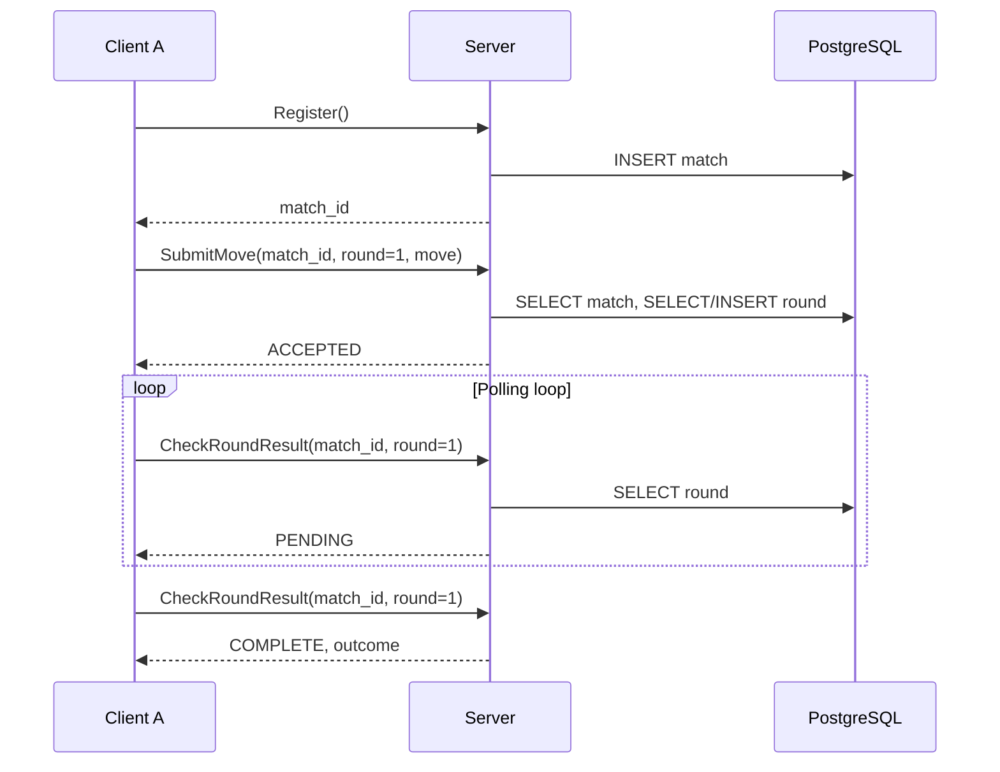
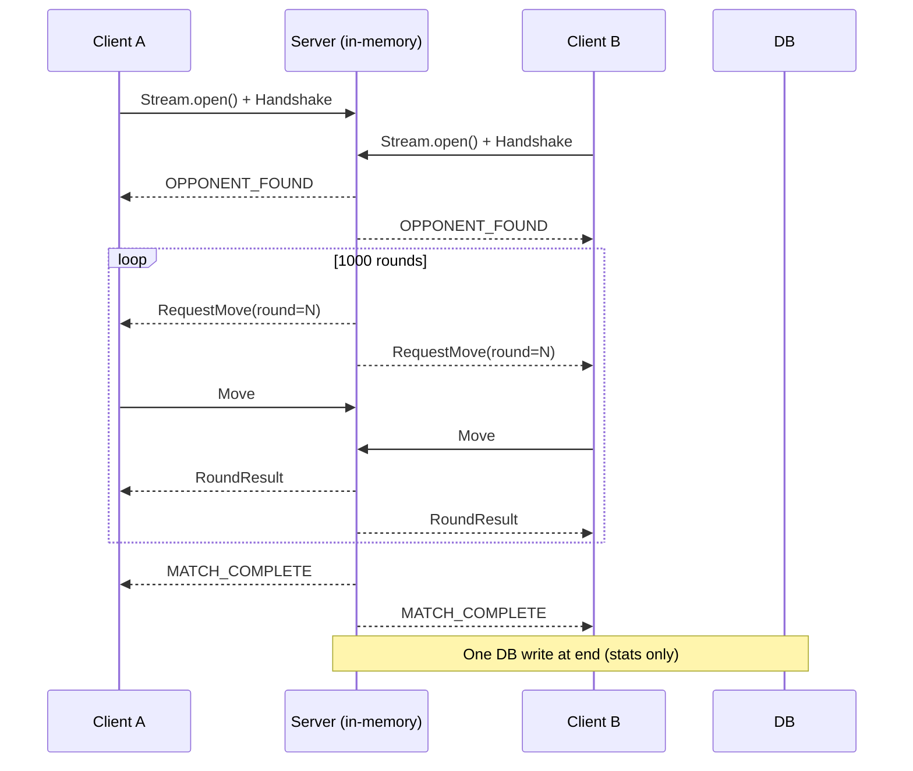

# Lesson 2: gRPC Patterns — Unary vs Streaming

**Goal:** Choose the right RPC shape for your API — and understand why this arena implements the same game two different ways.

> **Prerequisites:** [Lesson 0](./00-grpc-primer.md) (run both client types once)

This is the **central lesson** in the series. Everything else — database choice, reactive vs virtual threads, deployment — follows from the decision you make here.

---

## The design question

You are building a two-player game server. Players join, play many rounds, get results. How should the API look?

**Option A — three unary RPCs:** register, submit move, check result (poll until done).  
**Option B — one bidirectional stream:** handshake once, then server pushes triggers and results.

Both are valid gRPC. This repo implements **both** so you can measure the trade-off in real code, not slides.

---

## The proto contracts side by side

### Unary: context on every call

```proto
service UnaryArenaService {
  rpc Register (RegisterRequest) returns (RegisterResponse);
  rpc SubmitMove (SubmitMoveRequest) returns (SubmitMoveResponse);
  rpc CheckRoundResult (CheckRoundResultRequest) returns (CheckRoundResultResponse);
}

message SubmitMoveRequest {
  string match_id = 1;      // "Which match am I in?"
  int32 round_number = 2;   // "What round is it?"
  int32 move = 3;
}
```

Two of three fields exist only to **re-establish context** the server knew a moment ago but did not keep in memory between calls.

### Streaming: context in the connection

```proto
service StreamingArenaService {
  rpc Battle (stream BattleRequest) returns (stream BattleResponse);
  rpc GetArenaResults (ArenaResultsRequest) returns (ArenaResultsResponse);
}

message BattleRequest {
  oneof payload {
    Handshake handshake = 1;  // once, at connect
    Move move = 2;            // just the move
  }
}
```

The `Move` message has **one field**. The server knows which match this belongs to because it arrived on **that client's stream**.

---

## Sequence diagrams: feel the difference

### Unary — client drives, server forgets, database remembers



### Streaming — server drives, connection remembers



---

## The unary service: database as memory

`UnaryArenaServiceImpl` returns `Uni<T>` from every method. Each call reconstructs state from PostgreSQL.

### Registration — find or create

```java
@Override
@WithTransaction
public Uni<RegisterResponse> register(RegisterRequest request) {
    return UnaryMatch.findWaitingMatches()
        .chain(waitingMatches -> {
            if (!waitingMatches.isEmpty()) {
                // join existing waiting match
                UnaryMatch match = waitingMatches.get(0);
                match.playerTwoName = request.getLanguageName();
                match.status = UnaryMatch.MatchStatus.READY;
                return match.persist().replaceWith(/* READY response */);
            } else {
                // create new waiting match
                UnaryMatch newMatch = new UnaryMatch();
                newMatch.matchId = UUID.randomUUID().toString();
                newMatch.playerOneName = request.getLanguageName();
                newMatch.status = UnaryMatch.MatchStatus.WAITING_FOR_OPPONENT;
                return newMatch.persist().replaceWith(/* WAITING response */);
            }
        });
}
```

### Submitting a move — pay the context tax

Every `SubmitMove` does roughly:

1. `SELECT` match (with pessimistic lock — see Lesson 3)
2. `SELECT` round for `(match_id, round_number)`
3. `INSERT` or `UPDATE` round
4. Update match statistics

That is **~6 database operations per round**. Over 1,000 rounds: **~6,000 IOPS per match**.

### Polling — the latency tax

The server exposes a simple `CheckRoundResult` — but the client must loop:

```java
private CheckRoundResultResponse pollForResult(String matchId, int round) {
    return Multi.createBy().repeating()
        .uni(() -> mutinyStub.checkRoundResult(
            CheckRoundResultRequest.newBuilder()
                .setMatchId(matchId)
                .setRoundNumber(round).build()))
        .until(res -> "COMPLETE".equals(res.getStatus()))
        .collect().last()
        .await().atMost(Duration.ofSeconds(30));
}
```

Every poll: client → server → database → server → client. Multiply by however many polls until the opponent moves. This is the **polling anti-pattern** — if you are polling, you probably wanted a stream.

---

## The streaming service: connection as context

`StreamingArenaServiceImpl` keeps active matches in memory. No round-by-round database traffic.

### Opening the stream

```java
@Override
public Multi<BattleResponse> battle(Multi<BattleRequest> request) {
    BroadcastProcessor<BattleResponse> processor = BroadcastProcessor.create();
    StreamPlayer player = new StreamPlayer(connectionId, processor);

    request.subscribe().with(
        message -> handleClientMessage(player, message),
        failure -> cleanupPlayer(player),
        () -> cleanupPlayer(player)
    );

    return processor;
}
```

The method receives `Multi<BattleRequest>` (inbound) and returns `Multi<BattleResponse>` (outbound). The `BroadcastProcessor` is a programmatic emitter — call `processor.onNext(...)` anywhere to push to that client.

### The pulse — server-driven rounds

```java
private void startNextRound(StreamMatch match) {
    RequestMove trigger = RequestMove.newBuilder()
        .setRoundId(match.currentRound).build();

    match.playerOne.processor.onNext(
        BattleResponse.newBuilder().setTrigger(trigger).build());
    match.playerTwo.processor.onNext(
        BattleResponse.newBuilder().setTrigger(trigger).build());
}
```

The server tells clients **when** to move. Clients respond with three lines:

```java
} else if (update.hasTrigger()) {
    int move = random.nextInt(3);
    requestProcessor.onNext(BattleRequest.newBuilder()
        .setMove(Move.newBuilder().setMove(move).build())
        .build());
}
```

**IOPS during the match:** 0. **At completion:** 1 stats write. For 1,000 rounds: **1 write**.

---

## The numbers

| Metric | Unary (polling) | Streaming (push) |
|---|---|---|
| DB ops per 1,000-round match | ~6,000 | 1 |
| Round latency | 50–200 ms (poll + DB) | 1–5 ms (memory) |
| Client complexity | manages match_id, round, poll loop | handshake + react to triggers |
| Server state | durable in PostgreSQL | volatile in memory |
| Horizontal scaling | easier (stateless RPCs) | harder (sticky connections) |

Neither row "wins" universally. The arena makes the gap **visceral** so you remember it when designing your own API.

---

## Client complexity: driver vs responder

### Unary client — you own the flow

```java
RegisterResponse reg = mutinyStub.register(...).await().atMost(...);
String matchId = reg.getMatchId();

for (int round = 1; round <= TOTAL_ROUNDS; round++) {
    mutinyStub.submitMove(/* matchId, round, move */).await()...;
    CheckRoundResultResponse result = pollForResult(matchId, round);
}
```

More code. More ways to desync (wrong round number, stale match_id).

### Streaming client — you respond

```java
responses.subscribe().with(update -> {
    if (update.hasTrigger()) { sendMove(); }
    else if (update.getStatus().equals("MATCH_COMPLETE")) { done.countDown(); }
});
requestProcessor.onNext(/* handshake */);
done.await();
```

The client does not track round numbers. The server does.

---

## Polyglot clients: same contract, any language

The `.proto` files are the product. Go and Python clients generated from the same contract talk to any server:

```bash
# Quarkus server on 8080
./run-server.sh vt

# Go streaming client
cd clients/go && ./generate_protos.sh
go run streaming_client.go -host localhost -port 8080 -language Go

# Python streaming client
cd clients/python && ./generate_protos.sh
python3 streaming_client.py --host localhost --port 8080 --language Python
```

If the contract is stable, **swap Java for Go, Quarkus for Netty, reactive for virtual threads** — clients keep working. [Lesson 7](./07-deployment-and-polyglot.md) runs a full tournament across three languages.

---

## When to use which pattern

**Choose unary when:**

- Each operation is truly independent (lookup user, charge card once)
- You need stateless load balancing behind any random instance
- Clients connect briefly and disconnect
- A CDN or cache sits in front

**Choose streaming when:**

- Both sides send at unpredictable times
- Low latency matters more than operational simplicity
- The interaction is long-lived and stateful
- You would otherwise poll — **polling is a smell that you wanted push**

**Choose both when:**

- You need a simple REST-like RPC *and* a real-time channel (common in production: CRUD unary + live updates stream)

---

## Exercises

1. **Count the polls** — Add logging to `pollForResult` in `UnaryClient`. How many `CheckRoundResult` calls per round?
2. **Break round sync** — Submit move with wrong `round_number`. What does the server return? Why?
3. **Same game, different port** — Run `netty-server` (port 9000) with Go client. Then run `vt-server` (port 8080). Same `.proto`, different runtime.
4. **Read the proto comments** — Open `unary.proto` and `stream.proto`. The comments encode the design intent.

---

## What's next

The RPC shape you chose dictates **where state lives**:

**[Lesson 3: Where state lives](./03-hibernate-reactive.md)** — database tables vs in-memory maps vs the stream itself.
